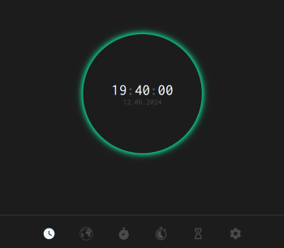
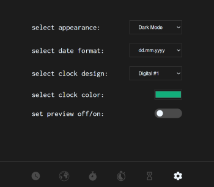

# yqni13 WEB_clock
$\texttt{\color{teal}{v1.3.0}}$

## Screenshot clock

    
    

### Technology 

    
    
    
    Google Fonts

### <a href="https://yqni13.github.io/WEB_clock">TRY LIVE DEMO</a>

 

## Features

<dl>
    <dd>:page_facing_up: Single Page Application</dd>
    <dd>:1234: Components as Javascript ES6 modules</dd>
    <dd>:wrench: Live changing settings via local storage</dd>
    <dd>:new_moon_with_face:/:sun_with_face: Dark/Light mode</dd>
    <dd>:art: Customizable design</dd>
</dl>

 

## Updates

### $\textsf{last\ update\ 1.3.0\ >>\ {\color{pink}1.4.0}}$

- $\textsf{\color{orange}Change:}$ Hint of "am" and "pm" to differ daytime added to analog design.
- $\textsf{\color{orange}Change:}$ Number of color pickers in settings will appear regarding which design is selected.

 

### Aimed objectives for next $\textsf{\color{green}minor}$ update:
<dl>
    <dd>- option to select ger/eng</dd>
    <dd>- add responsive design to clock component</dd>
    <dd>- add real-live working mini figures of clock design as preview in settings</dd>
    <dd>- option to select different time formats</dd>
</dl>

 

### Aimed objectives for next $\textsf{\color{cyan}major}$ update:
<dl>
    <dd>- different clock designs to select from</dd>
    <dd>- additional timer functionality</dd>
    <dd>- additional alarm functionality</dd>
    <dd>- additional world clock (api)</dd>
</dl>