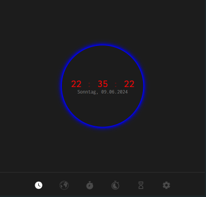

# yqni13 WEB_clock
$\texttt{\color{teal}{v1.0.0}}$

## Screenshot clock

    

### Technology 

    
    
    
    Google Fonts

### <a href="https://yqni13.github.io/WEB_clock">TRY LIVE DEMO</a>

 

## Updates

### Aimed objectives for next $\textsf{\color{green}minor}$ update:
<dl>
    <dd>- enable option to change color theme of clock</dd>
    <dd>- enable option to change color background theme</dd>
    <dd>- option to select ger/eng</dd>
    <dd>- option to select different date formats</dd>
    <dd>- option to select different time formats</dd>
</dl>

### Aimed objectives for next $\textsf{\color{cyan}major}$ update:
<dl>
    <dd>- different clock designs to select from</dd>
    <dd>- additional timer functionality</dd>
    <dd>- additional alarm functionality</dd>
    <dd>- additional world clock (api)</dd>
</dl>