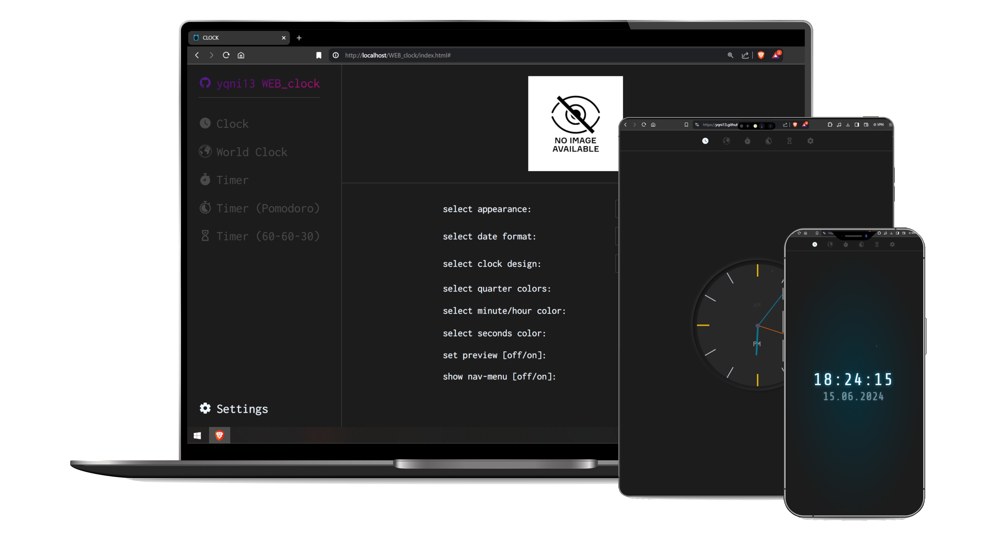
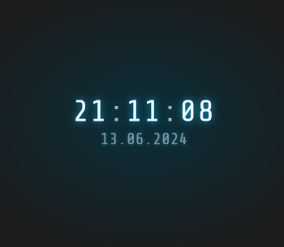
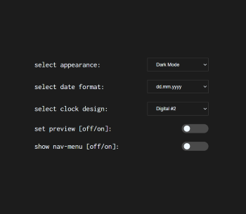
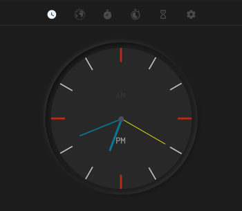
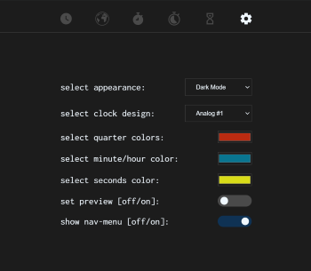
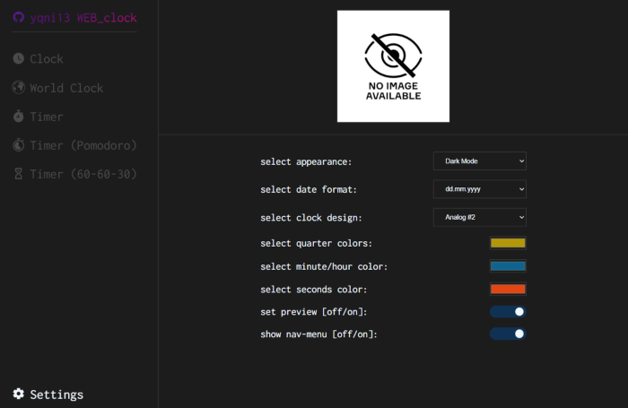

# yqni13 WEB_clock
$\texttt{\color{teal}{v2.1.2}}$

 

    

### Technology 

    
    
    
    Google Fonts

### <a href="https://yqni13.github.io/WEB_clock">TRY LIVE DEMO</a>

 

## Features

<dl>
    <dd>:page_facing_up: Single Page Application</dd>
    <dd>:1234: Components as Javascript ES6 modules</dd>
    <dd>:wrench: Live changing settings via local storage</dd>
    <dd>:new_moon_with_face:/:sun_with_face: Dark/Light mode</dd>
    <dd>:art: Customizable design</dd>
</dl>

 

    
    

    
One of the settings enables to hide the navbar (figure above). This way, the features can be enjoyed without any distractions. To use the nav-menu a simple click/touch is enough and for 2.5 seconds you can navigate to other components or the settings to display the nav-menu permanently again. As for default, the nav-menu is set to show constantly.

 

    
    

    
Depending on the selected design, multiple or single colors can be customized (figure above).

 

    

    
In the settings component, a preview for the selected clock design is already prepared and displays currently a placeholder (figure above). With an upcoming update, a downscaled version of the selected clock design will appear and can be hidden by the regarding setting.

 

## Testing

### Cross-browser testing

|  |  |  |  |
|:------:|:------:|:------:|:------:|
|Firefox | Chrome | Opera  | Edge   |
|Yes     | Yes    | Yes    | Yes    |

 

## Updates

[list of all updates](docs/update_protocol.md)
### $\textsf{last\ update\ 2.1.1\ >>\ {\color{pink}2.1.2}}$

- $\textsf{\color{red}Bugfix:}$ Navigation menu in mobile version is now located at top instead of bottom and available by every browser. [Before: Navigation menu was displayed at bottom in mobile version. Some browsers overlap with their own navigation menu at the same place to make the application nav unreachable (or more complicated).]

 

### Aimed objectives for next $\textsf{\color{green}minor}$ update:
<dl>
    <dd>- option to select ger/eng</dd>
    <dd>- add real-live working mini figures of clock design as preview in settings</dd>
</dl>

 

### Aimed objectives for next $\textsf{\color{cyan}major}$ update:
<dl>
    <dd>- additional timer functionality</dd>
    <dd>- additional alarm functionality</dd>
    <dd>- additional world clock (api)</dd>
</dl>