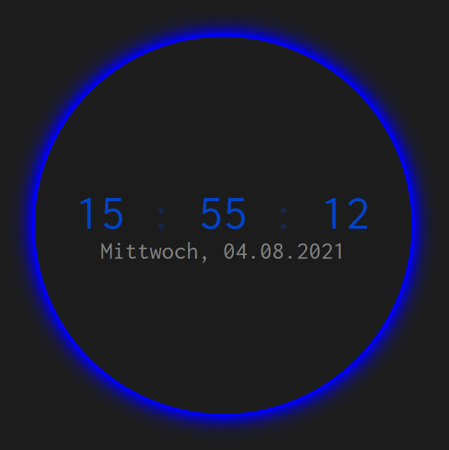

# WEB_clock
mini web project: clock (display time and date)

starts with blank value for time and date and refreshes values ever second to maintain current timestamp

images are to cover directory picture

